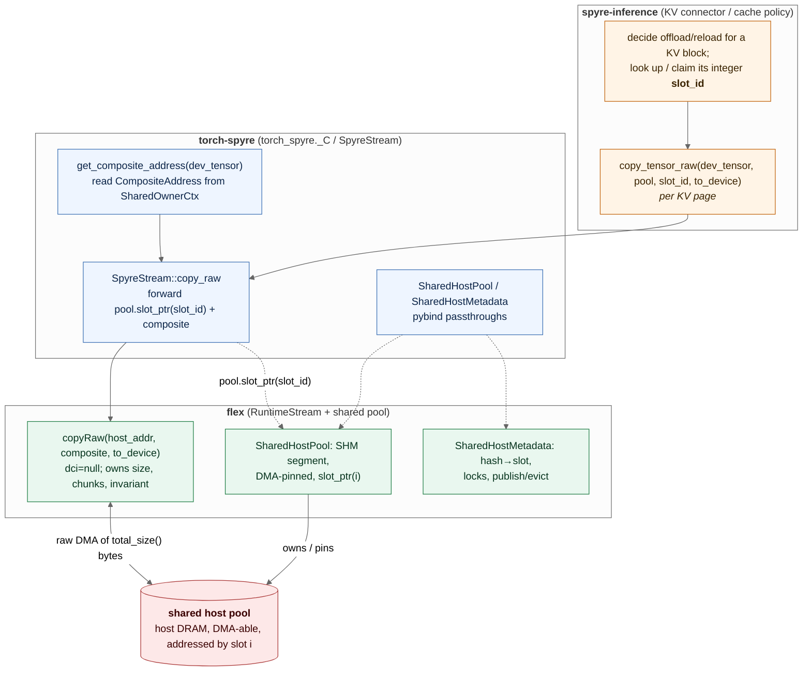

# Design: torch-spyre Python surface for flex-owned KV-cache offload

| Field | Value |
|---|---|
| Status | Draft |
| Created | 2026-07-07 |
| Updated | 2026-07-22 |
| Depends on | flex RFC *flex-owned Shared Host KV Pool (1p0 and 1p5)* (`flex:docs/RFCs/SharedHostKvPoolRFC_v3.md`) |
| Consumers | [spyre-inference](https://github.com/torch-spyre/spyre-inference) (KV-offload connector / cache policy) |
| Related | RFC 0171 (Spyre Device), RFC 0047 (Tiled Tensors); supersedes `torch-spyre` PR #2796 / issue #2744 |

## 1. Scope

The flex RFC (`SharedHostKvPoolRFC_v3.md`) delivers the **mechanism** for a cross-process shared
KV-cache host pool: `copyRaw` (raw device↔host DMA), `SharedHostPool` (a DMA-able shared-memory data
pool), and `SharedHostMetadata` (a shared directory with a concurrency protocol). spyre-inference owns
the **cache policy** (what to offload, when to evict) and the vLLM wiring.

**This document specifies only the middle layer: the torch-spyre Python surface** that lets
spyre-inference drive those flex objects. Per flex RFC §3.1, torch-spyre owns exactly two things:

1. **The one irreducible tensor-aware step** — turning a `device("spyre")` tensor into the flex device
   address (`CompositeAddress`) that a DMA needs. flex has no tensor concept, so this cannot live in
   flex; spyre-inference should not reach into tensor storage internals, so it does not live there
   either.
2. **Thin bindings** — pybind wrappers exposing `copyRaw`, `SharedHostPool`, and `SharedHostMetadata`
   to Python, so the whole mechanism is reachable through `torch_spyre._C`.

Everything else — the SHM segments, DMA pinning, the block-hash→slot directory, the per-slot locks,
the publish gate, eviction, the raw-copy correctness invariant, and the 1p0/1p5 backend differences —
is **flex's** and is **not restated here**. Where this doc needs one of those facts it cites the flex
RFC section rather than reproducing it.

The seam between torch-spyre and the layers above and below it is a plain **integer `slot_id`** (flex
RFC §3.1): spyre-inference names a KV block by slot; torch-spyre passes the slot and a tensor to flex;
raw host pointers never cross into Python.

The call path (connector → torch-spyre → flex → the shared pool):

<!-- Source: figures/copy-raw-call-path.{mmd,d2}. Regenerate with:
       npx -y -p @mermaid-js/mermaid-cli@10 mmdc -i docs/source/architecture/figures/copy-raw-call-path.mmd \
         -o docs/source/architecture/figures/copy-raw-call-path.svg -b transparent
       d2 docs/source/architecture/figures/copy-raw-call-path.d2 docs/source/architecture/figures/copy-raw-call-path.d2.svg -->


<details>
<summary>Diagram sources (Mermaid at <code>figures/copy-raw-call-path.mmd</code>; D2 at <code>figures/copy-raw-call-path.d2</code>, rendered to <code>copy-raw-call-path.d2.svg</code>)</summary>



</details>

## 2. What already exists in torch-spyre

Two pieces of the surface already have working analogues on `main`; the KV work reuses them rather
than inventing new machinery.

- **A tensor↔tensor DMA through flex.** `spyre::spyre_copy_from` (`torch_spyre/csrc/spyre_mem.cpp`)
  handles `_copy_from` between CPU and `spyre` tensors and drives a flex DMA. This is the *converting*
  copy (it may apply layout/dtype conversion); the KV path needs the *raw* variant instead (§3.1).
- **The device address is already resolvable from a tensor.** A `spyre` tensor's storage `data_ptr`
  carries a `SharedOwnerCtx` (`torch_spyre/csrc/spyre_allocator.h:26`) holding the flex device
  allocation handle (`owner`). `get_composite_address` (§3.2) is a read-only accessor over exactly
  this field — no new bookkeeping.
- **A pooled stream accessor exists.** `getStreamFromPool` / `getCurrentStream`
  (`torch_spyre/csrc/spyre_stream.{h,cpp}`) already map a `c10::Stream` to a `flex::StreamHandle`.
  `get_dma_stream` (§3.4) is a thin wrapper so offload/reload can run on a dedicated stream.

> **Sequencing note.** The flex objects this surface wraps (`copyRaw`, `SharedHostPool`,
> `SharedHostMetadata`) are **design-only** on the flex `rfc/shared-host-kv-pool` branch today — no C++
> symbols yet. Independently, flex's public allocation handle is migrating from the current DMPA-based
> `DeviceMemoryAllocation` to the `CompositeAddress` model the flex architecture docs describe; the
> `copyRaw(void*, const CompositeAddress*, bool)` signature assumes that migration has landed. So this
> torch-spyre PR is **ready to write against the flex API, but cannot merge until flex ships the
> mechanism** (flex RFC §5 steps 1–4). Keeping the tensor→address step behind the single
> `get_composite_address` accessor is what insulates this surface from the flex handle migration.

## 3. Proposed torch-spyre surface

Four Python-visible additions in `torch_spyre._C`, plus their C++ backing. The design principle is
**thin**: each binding forwards to a flex call and adds no policy.

### 3.1 `copy_tensor_raw` — raw DMA between a device tensor and a pool slot

```python
def copy_tensor_raw(
    dev_tensor: torch.Tensor,   # a device("spyre") tensor whose storage is the KV page
    pool: SharedHostPool,       # a flex SharedHostPool handle (§3.3)
    slot_id: int,               # integer slot index within the pool
    to_device: bool,            # True: slot -> device (reload); False: device -> slot (offload)
    non_blocking: bool = False,
) -> None: ...
```

torch-spyre resolves `dev_tensor`'s `CompositeAddress` (§3.2), then calls
`flex::RuntimeStream::copyRaw(pool.slot_ptr(slot_id), composite_addr, to_device)` on the DMA stream.
The host address is obtained from the flex pool **inside** the call; it is never surfaced to Python
(§1 seam). The copy length, chunk handling, and byte-identical-layout guarantee are entirely flex's
(`copyRaw`, flex RFC §4.1 and Appendix B) — torch-spyre passes the `CompositeAddress` and the slot and
does **not** compute a size or assert chunk shape.

`non_blocking=False` calls `stream.synchronize()` after enqueue (matching the existing copy contract);
`non_blocking=True` returns after enqueue and the caller synchronizes before treating the transfer as
complete (e.g. before flex flips the slot to `VALID`, flex RFC §4.4).

### 3.2 `get_composite_address` — the one tensor-aware step

```python
def get_composite_address(dev_tensor: torch.Tensor) -> CompositeAddressHandle: ...
```

Returns an opaque handle wrapping the `flex::CompositeAddress` that backs `dev_tensor`'s storage —
the handle held by the tensor's `SharedOwnerCtx` (`torch_spyre/csrc/spyre_allocator.h:26`). This is
the **only** binding that touches tensor internals, and it is the step flex RFC §3.1 explicitly places
in torch-spyre. It is consumed by `copy_tensor_raw` internally, and exposed so spyre-inference can
cache the handle per KV page instead of re-resolving it every transfer. The handle holds no ownership
and is invalidated when the tensor's storage is freed.

### 3.3 `SharedHostPool` / `SharedHostMetadata` — pybind wrappers over the flex objects

```python
class SharedHostPool:
    @staticmethod
    def create_or_attach(
        stream: SpyreStreamHandle, name: str, num_slots: int, slot_bytes: int
    ) -> "SharedHostPool": ...
    def slot_count(self) -> int: ...
    def slot_bytes(self) -> int: ...
    # slot_ptr is intentionally NOT exposed to Python (§1 seam); copy_tensor_raw uses it in C++.

class SharedHostMetadata:
    @staticmethod
    def create_or_attach(name: str, num_slots: int, max_chunks: int) -> "SharedHostMetadata": ...
    # lookup / claim / publish / evict / generation-checked pin, per flex RFC §4.3–§4.4.
```

These are **one-to-one pybind exposures of the flex classes** (flex RFC §4.2, §4.3) so spyre-inference
reaches the whole mechanism through `torch_spyre._C`. torch-spyre adds nothing to them — no SHM
creation of its own, no locking, no directory logic. The exact method set on `SharedHostMetadata`
tracks the flex header once it lands; the binding is a passthrough. Which layer *calls* these (the
spyre-inference connector) and the eviction policy are out of torch-spyre scope (flex RFC §3.1, §3.4).

### 3.4 `get_dma_stream` — the pooled stream to issue copies on

```python
def get_dma_stream(device: torch.device | None = None) -> SpyreStreamHandle: ...
```

Thin wrapper over `getStreamFromPool(device, priority=0)` so the connector can keep a dedicated DMA
stream, letting offload/reload overlap the compute stream once async lands (§5). `copy_tensor_raw` and
`SharedHostPool.create_or_attach` accept an optional explicit stream; when omitted they use the
current stream for the device.

## 4. C++ backing

`copy_tensor_raw`'s backing resolves the same `SharedOwnerCtx` device handle the existing copy path
uses, then calls the new flex `copyRaw` with a null `dci`. Sketch (names align with the flex API once
it lands):

```cpp
// torch_spyre/csrc/spyre_stream.{h,cpp} — new method
void SpyreStream::copy_raw(const at::Tensor& dev_tensor,
                           flex::SharedHostPool* pool, uint64_t slot_id,
                           bool to_device, bool non_blocking) const {
  auto* ctx = static_cast<SharedOwnerCtx*>(
      dev_tensor.unsafeGetTensorImpl()->storage().data_ptr().get_context());
  const flex::CompositeAddress* composite = get_composite_address(*ctx);  // §3.2

  // flex owns size, chunk handling, and the byte-identical-layout invariant (flex RFC §4.1, App. B).
  resolveRuntimeHandle()->copyRaw(pool->slot_ptr(slot_id), composite, to_device);

  if (!non_blocking) resolveRuntimeHandle()->synchronize();
}
```

`SharedHostPool` / `SharedHostMetadata` bindings are pybind passthroughs to the flex classes.
`get_composite_address` returns the handle from `SharedOwnerCtx`. All bindings sit next to the existing
copy/stream bindings in `torch_spyre/csrc/module.cpp`.

### 4.1 Ownership and lifetime

- torch-spyre **never** allocates or maps a shared segment, **never** pins host memory, and **never**
  touches the directory, per-slot locks, or publish gate. Those are flex's (flex RFC §4.2–§4.4). The
  torch-spyre surface is exactly: resolve the device handle, forward a raw DMA, wrap the flex objects.
- The `SharedHostPool` / `SharedHostMetadata` Python objects hold flex handles; their lifetime (attach
  refcount, `shm_unlink` on last-out) is flex's (flex RFC §4.2). torch-spyre just holds the handle for
  as long as the Python object is alive.

## 5. Out of scope / follow-ups

- **Cache policy and connector wiring** — offload/reload decisions, eviction, tiering (flex RFC §2.2)
  live in spyre-inference, not here.
- **Async / batched raw copy** — the first cut keeps `non_blocking=False`. Overlapping offload with
  compute depends on the torch-spyre stream/event story maturing and would extend `copy_tensor_raw`
  with a completion event; tracked separately.
- **1p5 backing selection** — whether the flex pool is a DMA-able handle or a pinned external SHM
  pointer is a flex decision (flex RFC §4.2, §6.1). **This Python surface is unchanged either way** —
  it names a pool and a slot; only flex's backing differs.
- **Stable device KV descriptor** — `get_composite_address` returns a handle tied to a live tensor. A
  descriptor independent of an allocated tensor (for a future direct device↔storage path) is a
  separate design.

## 6. Acceptance

- [ ] `torch_spyre._C.copy_tensor_raw` round-trips a device KV page through a flex `SharedHostPool`
      slot: allocate a `device("spyre")` tensor with a known fp16 pattern, offload
      (`to_device=False`), zero the tensor, reload (`to_device=True`), assert equal.
- [ ] Reloading a slot into a **different** same-`(shape, dtype)` tensor reproduces the pattern
      (drives the flex round-trip test, flex RFC §5, from Python).
- [ ] `get_composite_address` returns a handle whose reported chunk shape matches the tensor's
      allocation, and is rejected after the tensor's storage is freed.
- [ ] `SharedHostPool` / `SharedHostMetadata` create-or-attach from two processes see the same slots
      (two-instance produce→consume, driven from Python).
- [ ] The existing `copy_tensor` / `_copy_from` path is unaffected.
```