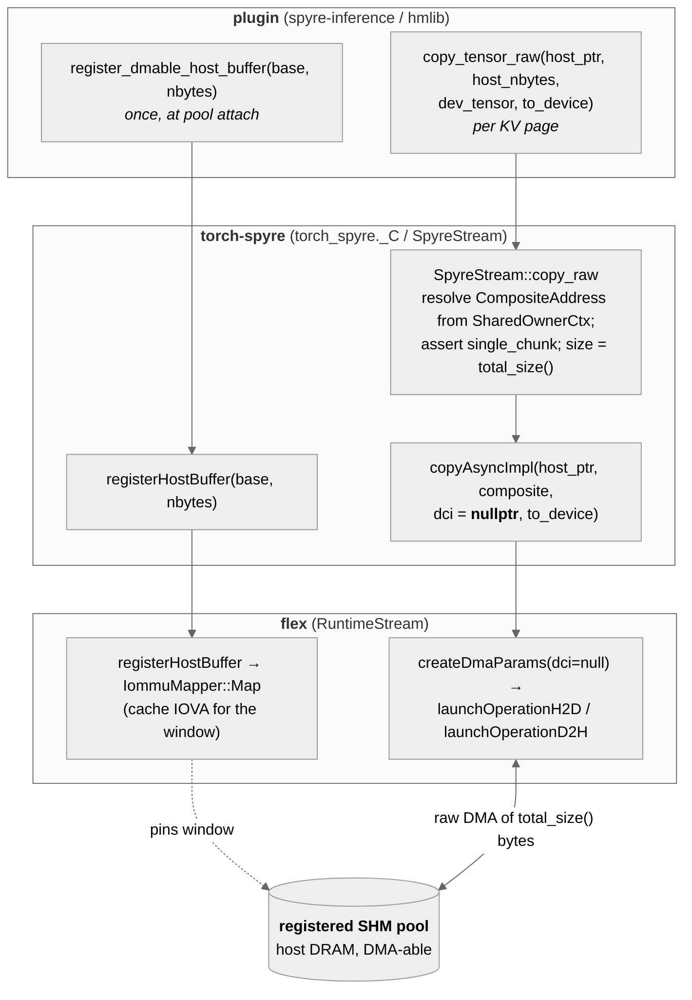

# Design: Exposing flex raw-copy + shared-host-DMA to Python for KV-cache offload

| Field | Value |
|---|---|
| Status | Draft |
| Created | 2026-07-07 |
| Depends on | flex RFC *Raw Tensor Copy + Shared Host Memory DMA* (`flex:docs/RFCs/RawCopySharedHostMemoryRFC.md`) |
| Consumers | [spyre-inference #240](https://github.com/torch-spyre/spyre-inference/pull/240) (KV offload), the hmlib shared-memory KV runtime |
| Related | RFC 0171 (Spyre Device), RFC 0047 (Tiled Tensors), `torch-spyre` PR #2796 / issue #2744 (`copy_tensor_raw`) |

## 1. Motivation

The [flex RFC](../rfcs/index.md) makes two primitives first-class in the per-process flex
runtime:

- **`RuntimeStream::copyRaw(host_addr, CompositeAddress*, to_device)`** — a raw
  (`dci == nullptr`), single-chunk, byte-for-byte host↔device DMA that copies exactly the device
  allocation's `total_size()`.
- **`RuntimeStream::registerHostBuffer(base, size)` / `unregisterHostBuffer(base)`** — amortized
  registration of an *externally-allocated* (e.g. POSIX-SHM / `mmap`'d) host window as a DMA
  endpoint, so many `copyRaw` calls into that window pay no per-call IOMMU pin.

Those are C++ methods on `flex::RuntimeStream`. This document specifies the **torch-spyre Python
surface** that exposes them, so that a KV-cache offload plugin
([spyre-inference](https://github.com/torch-spyre/spyre-inference)) — and specifically an
hmlib-style shared-memory KV store — can:

1. Snapshot a device KV page to a host buffer and restore it later (**`copy_tensor_raw`**), and
2. Make its **own** cross-process shared SHM pool a valid DMA endpoint
   (**`register_dmable_host_buffer`**), rather than being forced to DMA only into torch-owned CPU
   tensors.

The call path (plugin → torch-spyre → flex → the registered SHM pool):

<!-- Source: figures/copy-raw-call-path.{mmd,d2}. Regenerate with:
       npx -y -p @mermaid-js/mermaid-cli@10 mmdc -i docs/source/architecture/figures/copy-raw-call-path.mmd \
         -o docs/source/architecture/figures/copy-raw-call-path.svg -b transparent
       d2 docs/source/architecture/figures/copy-raw-call-path.d2 docs/source/architecture/figures/copy-raw-call-path.d2.svg -->



<details>
<summary>Diagram sources (Mermaid at <code>figures/copy-raw-call-path.mmd</code>; D2 at <code>figures/copy-raw-call-path.d2</code>, rendered to <code>copy-raw-call-path.d2.svg</code>)</summary>



</details>

### 1.1 Why the existing `copy_tensor` is not sufficient

spyre-inference #240 milestone 1 already uses `torch_spyre._C.copy_tensor(src, dst,
non_blocking=False)` — `SpyreStream::copyAsync` → flex DMA — to move a device KV page into a
**torch-owned CPU tensor**. That is the right primitive for single-instance, single-tier host-RAM
offload. It is **not** sufficient for a cross-instance *shared* pool, for two reasons:

- **The destination must be a raw pointer into a shared segment, not a `torch.Tensor`.** A shared KV
  pool is a POSIX-SHM segment mapped by several processes; a slot is addressed by an integer offset,
  and the bytes are an opaque device-format image (RFC §5 correctness invariant). `copy_tensor`
  takes two `at::Tensor`s and (via the normal copy path) may apply layout/dtype conversion; KV needs
  a *raw* copy of `total_size()` bytes to/from `pool_base + slot*slot_bytes`.
- **The shared window must be pinned for DMA once, not re-pinned per copy.** With `copy_tensor`, the
  CPU tensor is not a registered DMA endpoint the plugin controls; each transfer implicitly pins.
  A shared pool is mapped once and DMA'd into for the process lifetime, so registration belongs at
  attach time (mirrors `cudaHostRegister` vs `cudaMemcpyAsync`).

Hence two new bindings: a raw copy that accepts a host pointer + device tensor, and an explicit
register/unregister of an external host window.

## 2. Current state in torch-spyre

`SpyreStream` (`torch_spyre/csrc/spyre_stream.{h,cpp}`) owns the mapping from a `c10::Stream` to a
`flex::RuntimeStream` handle **and already implements a tensor↔tensor DMA** — `copyAsync` /
`copyAsyncImpl` are live, not stubs:

```cpp
// spyre_stream.cpp — today (real)
void SpyreStream::copyAsync(const at::Tensor& src, const at::Tensor& dst) const {
  bool host2device = src.is_cpu() && dst.is_privateuseone();
  bool device2host = src.is_privateuseone() && dst.is_cpu();
  const at::Tensor* dev_tensor = host2device ? &dst : &src;
  const at::Tensor* cpu_tensor = host2device ? &src : &dst;
  void* cpu_ptr = const_cast<void*>(cpu_tensor->storage().data());
  SpyreTensorLayout stl = get_spyre_tensor_layout(*dev_tensor);
  auto* ctx = static_cast<SharedOwnerCtx*>(               // holds the CompositeAddress
      dev_tensor->unsafeGetTensorImpl()->storage().data_ptr().get_context());
  DataConversionInfo dci = generate_dci(cpu_tensor, dev_tensor, stl,
                                        cpu_tensor->storage_offset(), host2device);
  copyAsyncImpl(cpu_ptr, &ctx->composite_addr, &dci, host2device);
}

void SpyreStream::copyAsyncImpl(void* cpu_ptr,
                                const flex::CompositeAddress* device_address,
                                const DataConversionInfo* dci, bool host2device) const {
  auto dci_ptr = dci ? std::make_shared<data_conversion_info>(*dci) : nullptr;
  auto* params = flex::createDmaParams(cpu_ptr, device_address->total_size(),
                                       host2device, device_address, std::move(dci_ptr));
  host2device ? launchH2D(params) : launchD2H(params);   // -> launchOperation{H2D,D2H}
  flex::destroyDmaParams(params);
}
```

This is already the shape the raw path needs, and it does three of the load-bearing things: it
extracts the device tensor's `flex::CompositeAddress` from `SharedOwnerCtx`
(`spyre_allocator.cpp:150`), sizes the DMA by `device_address->total_size()` (the padded/tiled
physical size, **not** `numel*itemsize`), and dispatches through `flex::createDmaParams` →
`launchOperationH2D/D2H`. Crucially `copyAsyncImpl` **already accepts a null `dci`**, and
`createDmaParams` treats `dci == nullptr` as a straight byte copy — so a *raw* copy is
`copyAsyncImpl` with `dci = nullptr`, no new mechanism.

The public Python entrypoint today is `torch_spyre._C.copy_tensor` (`module.cpp:338` →
`spyre::spyre_copy_from` → `copyAsync`), which takes two `at::Tensor`s and always builds a real
`dci` via `generate_dci`. What is missing for a shared SHM KV pool is therefore narrow:

1. a variant that takes a **raw host pointer + length** (a pool slot, not an `at::Tensor`) and passes
   `dci = nullptr` to `copyAsyncImpl`, and
2. an explicit **register/pin** of the external host window — there is no `cudaHostRegister`
   equivalent today, so per-call pinning inside `submitDma` is the only path.

`getStreamFromPool` / `getCurrentStream` already give a pooled `SpyreStream`, so
`get_dma_stream(device)` is a thin accessor over the existing pool.

## 3. Proposed torch-spyre surface

Four Python-visible additions (all in `torch_spyre._C`), plus their C++ backing on `SpyreStream`.

### 3.1 `copy_tensor_raw` — raw DMA between a host pointer and a device tensor

```python
def copy_tensor_raw(
    host_ptr: int,            # integer host virtual address (into the plugin's SHM slot)
    host_nbytes: int,         # bytes available at host_ptr; must be >= dev_tensor total_size()
    dev_tensor: torch.Tensor, # a device("spyre") tensor whose storage is the KV page
    to_device: bool,          # True: host_ptr -> device (restore); False: device -> host_ptr (snapshot)
    non_blocking: bool = False,
) -> None: ...
```

Semantics:

- Resolves `dev_tensor`'s `CompositeAddress` (see §3.3) and its `total_size()` (the padded, tiled
  physical byte count — **not** `numel * itemsize`), asserts single-chunk, asserts
  `host_nbytes >= total_size()`, and calls `RuntimeStream::copyRaw(host_ptr, composite_addr,
  to_device)` on the current (or a supplied) DMA stream.
- `non_blocking=False` calls `stream.synchronize()` after enqueue, matching `copy_tensor`'s
  contract, so callers can treat it as synchronous. `non_blocking=True` returns after enqueue; the
  caller syncs (or awaits the completion callback) before flipping a slot to VALID.
- The host pointer **should** fall inside a window previously passed to
  `register_dmable_host_buffer` (§3.2); if it does not, on 1p0 flex pins per call (correct, slower)
  and on 1p5 (§7.1 = "no") the call raises.

A tensor-typed convenience overload `copy_tensor_raw(host_tensor: torch.Tensor, dev_tensor,
to_device, non_blocking=False)` is also provided for callers that already hold a CPU `at::Tensor`
(it forwards `host_tensor.data_ptr()` and `host_tensor.nbytes`). The pointer form is what the shared
SHM-pool plugin uses because its slots are not torch tensors.

### 3.2 `register_dmable_host_buffer` / `unregister_dmable_host_buffer`

```python
def register_dmable_host_buffer(host_ptr: int, nbytes: int, device: torch.device | None = None) -> None: ...
def unregister_dmable_host_buffer(host_ptr: int, device: torch.device | None = None) -> None: ...
def dmable_host_buffer_alignment(device: torch.device | None = None) -> int: ...
```

- `register_dmable_host_buffer(base, nbytes)` → `RuntimeStream::registerHostBuffer(base, nbytes)`
  on the device's DMA stream. Called **once** by the plugin right after it `mmap`s its shared KV
  pool. Idempotent per `(device, base, nbytes)`. On 1p0 this pins the whole window via the IOMMU
  mapper and caches the IOVA; on 1p5 it requires the senlib external-pointer pin (flex RFC §7.1) and
  raises `HostBufferNotRegisterable` if unavailable — the signal for the plugin to instead source
  its pool from a flex-owned `SharedHostPool` (flex RFC §4.4).
- `dmable_host_buffer_alignment()` → `RuntimeStream::getIovaAlignment()`. The plugin aligns its pool
  base and per-slot stride to this to avoid the 1p0 unaligned shadow-buffer fallback.

### 3.3 `get_composite_address` — the device-side handle a raw copy needs

```python
def get_composite_address(dev_tensor: torch.Tensor) -> CompositeAddressHandle: ...
```

Returns an opaque handle wrapping the `flex::CompositeAddress*` that backs `dev_tensor`'s storage —
the `ctx->composite_addr` on the `SharedOwnerCtx` held by the tensor's storage `data_ptr` context
(created in `spyre_allocator.cpp:150`), i.e. the exact value `copyAsync` reads today (§2). It is
consumed by `copy_tensor_raw` internally; it is exposed so a plugin can (a) assert single-chunk up
front and (b) cache the handle per registered KV page rather than re-resolving it on every transfer.
The handle holds no ownership and is invalidated if the tensor's storage is freed.

### 3.4 `get_dma_stream` — the pooled stream to issue copies on

```python
def get_dma_stream(device: torch.device | None = None) -> SpyreStreamHandle: ...
```

Thin wrapper over `getStreamFromPool(device, priority=0)`. Lets the plugin keep a dedicated
low-priority DMA stream so offload/reload overlaps the compute stream once async is enabled
(today everything is synchronous; async is a follow-up — see §6). All the `copy_tensor_raw` /
`register_dmable_host_buffer` calls above accept an optional explicit stream; when omitted they use
the current stream for the device.

## 4. C++ implementation sketch

All four land on `SpyreStream`, and `copy_raw` **reuses the existing `copyAsyncImpl`** (§2) — the
only change is passing `dci = nullptr` and taking the host pointer + device `CompositeAddress`
directly instead of deriving them from two tensors.

```cpp
// spyre_stream.h — additions
void copy_raw(void* host_ptr, size_t host_nbytes,
              const at::Tensor& dev_tensor, bool to_device,
              bool non_blocking) const;

void register_host_buffer(void* base, size_t nbytes) const;    // -> flex registerHostBuffer
void unregister_host_buffer(void* base) const;                 // -> flex unregisterHostBuffer
size_t iova_alignment() const;                                 // -> flex getIovaAlignment
```

`copy_raw` body — resolve the same `CompositeAddress` `copyAsync` uses, then call the existing
`copyAsyncImpl` with a null `dci`:

```cpp
void SpyreStream::copy_raw(void* host_ptr, size_t host_nbytes,
                           const at::Tensor& dev_tensor, bool to_device,
                           bool non_blocking) const {
  auto* spyre_impl = static_cast<SpyreTensorImpl*>(dev_tensor.unsafeGetTensorImpl());
  auto* ctx = static_cast<SharedOwnerCtx*>(
      spyre_impl->storage().data_ptr().get_context());        // same source as copyAsync
  const flex::CompositeAddress* composite = &ctx->composite_addr;
  TORCH_CHECK(composite->is_single_chunk(),
              "copy_tensor_raw requires a single-chunk device allocation");
  TORCH_CHECK(host_nbytes >= composite->total_size(),
              "host buffer (", host_nbytes, " B) smaller than device total_size() (",
              composite->total_size(), " B)");

  copyAsyncImpl(host_ptr, composite, /*dci=*/nullptr, to_device);   // raw: dci == nullptr
  if (!non_blocking) resolveRuntimeHandle()->synchronize();
}
```

`register_host_buffer` / `unregister_host_buffer` / `iova_alignment` forward one-to-one to the new
flex `RuntimeStream` methods (via `resolveRuntimeHandle()`). `get_composite_address` (§3.3) exposes
the same `ctx->composite_addr` used above. All bindings go next to `copy_tensor` in
`torch_spyre/csrc/module.cpp:338`.

### 4.1 Ownership and lifetime

- torch-spyre **never** allocates or maps the shared pool and **never** touches the block-hash→slot
  directory, the cross-process lock, or the publish gate. Those are the plugin's (flex RFC §6). The
  torch-spyre surface is exactly: resolve the device handle, register/pin a host window, issue the
  raw DMA, sync.
- A registered window's IOVA lives as long as the `RuntimeStream` (per-process). The plugin is
  expected to `unregister_dmable_host_buffer` on pool teardown; process exit tears the per-process
  IOMMU table down regardless.

## 5. Correctness invariants (carried from the flex RFC)

- **Copy `total_size()`, never `numel * itemsize`.** Device tiling + 128-byte stick alignment make
  the physical size larger than the logical size; copying the logical size truncates the tiled tail
  and corrupts reload. `copy_tensor_raw` derives the length from `CompositeAddress::total_size()`
  and ignores the tensor's logical byte count.
- **Single-chunk only.** Asserted at every `copy_tensor_raw`. Multi-chunk (`Interleave`) is out of
  scope and already rejected by the UMI scheduler.
- **Same `(shape, dtype)` ⇒ byte-identical on-card layout.** A page snapshotted from one KV slot can
  be restored into any other same-`(shape, dtype)` slot. This is what makes a shared, content-hashed
  pool sound (holds for one model; re-open if KV ever allocates multi-chunk).

## 6. Out of scope / follow-ups

- **Async / batched raw copy.** M1 keeps everything synchronous (`non_blocking=False`). An async path
  that overlaps offload with compute depends on the torch-spyre stream/event story maturing (RFC 0171
  open question) and would extend `copy_tensor_raw` with a completion-event return; tracked separately.
- **1p5 external-pointer pin.** `register_dmable_host_buffer` on 1p5 depends on senlib 1.5 being able
  to pin an external mmap'd pointer (flex RFC §7.1). Until resolved, 1p5 users fall back to a
  flex-owned `SharedHostPool`; this doc's Python surface is unchanged either way (only the backing of
  `register_dmable_host_buffer` differs).
- **Stable on-device KV descriptor.** `get_composite_address` returns a handle tied to a live tensor.
  A descriptor independent of an allocated tensor (for a future direct device↔storage path) is a
  separate design.

## 7. Acceptance

- [ ] `torch_spyre._C.copy_tensor_raw` round-trips a device KV page through a plain `mmap` host
      buffer: allocate a `device("spyre")` tensor with a known fp16 pattern, `copy_tensor_raw(..., to_device=False)`
      into the mmap buffer, zero the tensor, `copy_tensor_raw(..., to_device=True)` back, assert equal.
- [ ] Restoring a snapshot into a **different** same-`(shape, dtype)` tensor reproduces the pattern
      (the flex RFC §9 round-trip test, driven from Python).
- [ ] `register_dmable_host_buffer` over a large mmap window followed by many `copy_tensor_raw` calls
      issues **zero** per-call IOMMU pins on 1p0 (verified via flex counters / trace).
- [ ] `copy_tensor_raw` with `host_nbytes < total_size()` raises, and with a multi-chunk tensor raises.
- [ ] Existing `copy_tensor` path and the M1 offload tests are unaffected.
